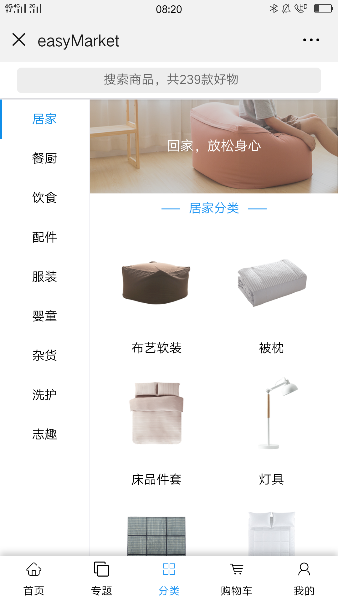
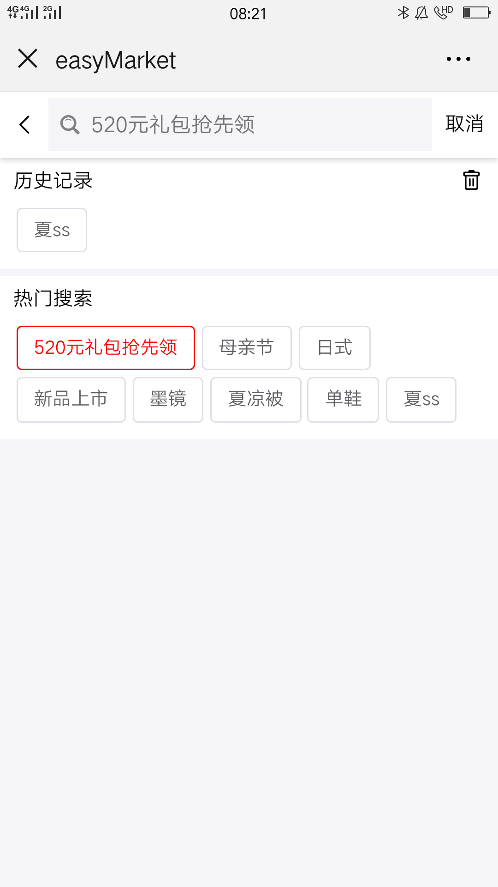
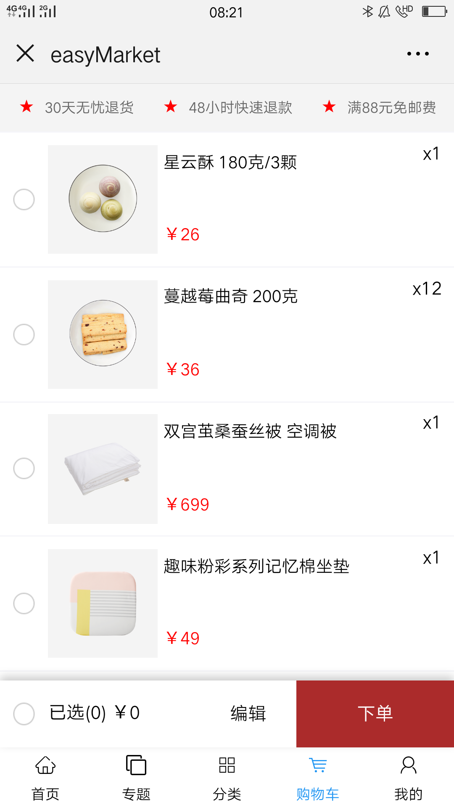
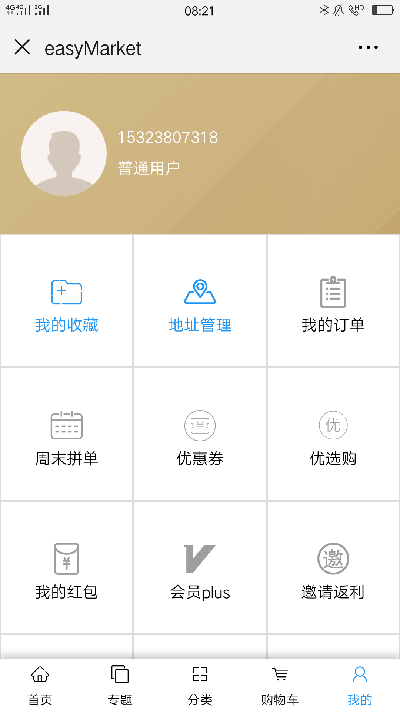

# EasyMarket [易购](https://github.com/Peroluo/easyMarketApp)

> ​EasyMarket 是仿网易严选 UI 设计的 H5 webApp。项目是基于 React+Redux+Redux-saga+Axios+React-router。
> ​EasyMarket 采用阿里 antd-design-mobile 的 UI 组件。

<!-- ## EasyMarket 扫码预览

#### 微信浏览器，请点击"访问原网页"

<figure >

</figure > -->

## EasyMarket Screenshots

|         首页         |         商品分类         |
| :------------------: | :----------------------: |
|  |  |

|         专题          |          专题详情           |            分类检索            | 
| :-------------------: | :-------------------------: | :----------------------------: |
|  |  |  |

|        购物车        |          商品详情           |         我的         |
| :------------------: | :-------------------------: | :------------------: |
|  |  |  |

## EasyMarket Preview

<figure class="third">
    
</figure>

## EasyMarket Tips

> - EasyMarket 正在更新维护状态，部分功能尚未没完成。
> - 倘若您发现 Bug 或者有优化意见及其他宝贵意见，欢迎您提交 issue 或者联系我 qq = 1025558554 、Email = 1025558554@qq.com
> - EasyMarket 服务端 ，请移步至 [EasyMarketSever](https://github.com/Peroluo/easyMarketSever)。

## EasyMarket 未完成功能

> - 支付订单、订单查询、优惠券...未来会不断完善！

## End

> - 喜欢 EasyMarket，帮忙点个 Star 吧!
> - 作者还会不断更新， 您的支持是作者不断更新的动力!
> - Thanks!

## About Me

> Name: 斌少
>
> QQ: 799770735
>
> Email：700770735@qq.com